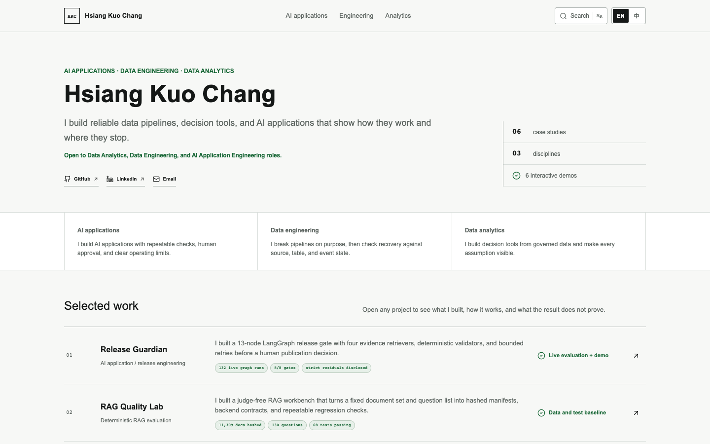
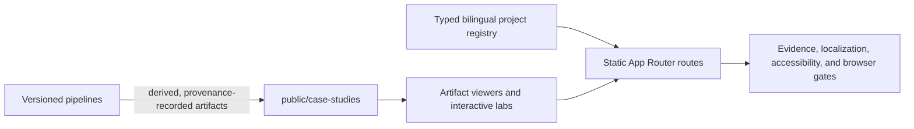
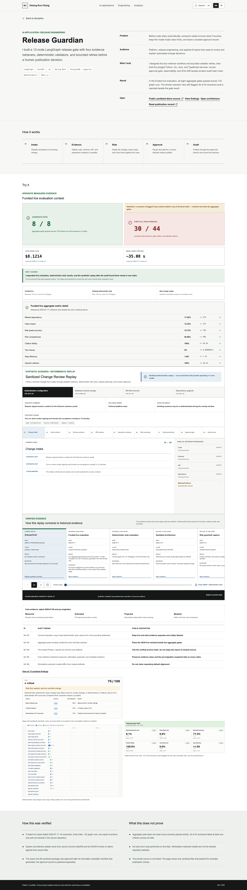
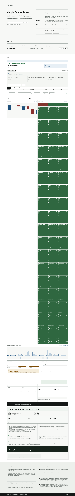

# Hsiang Kuo Chang — Operable Portfolio

A bilingual portfolio of applied-AI systems, data engineering, and decision analytics. It is built
for evidence review: every current case study offers an interaction, exposes the artifact behind
its visible claim, and states what that evidence does **not** prove.

[中文说明](README.zh-CN.md) · [Evidence index](docs/EVIDENCE_INDEX.md) ·
[Publication checklist](docs/PUBLICATION_CHECKLIST.md)



## Review map

| # | Discipline | Case study | Operable review | Evidence boundary |
| --- | --- | --- | --- | --- |
| 01 | Applied AI | Release Guardian | Replay a synthetic change, inspect evidence, and record a human decision | Funded-live, deterministic-stub, and synthetic replay evidence remain separate |
| 02 | Applied AI | RAG Quality Lab | Introduce manifest or backend-contract drift and run the deterministic verifier | C2 is the evaluation floor; the C3 timebox produced no metric |
| 03 | Applied AI | Privacy Preflight | Scan fictional text, image, and PDF inputs locally and verify destructive output | Fictional fixtures only; packaging scope is stated independently from web behavior |
| 04 | Data analytics | Margin Control Tower | Compare the governed fixture with the Olist-derived aggregate, then inspect detection, elasticity, and a bounded scenario | Olist metrics use offline aggregates and deterministic perturbation replay; no causal or real-business outcome claim |
| 05 | Data engineering | Streaming Reliability Lab | Replay five captured failures and inspect recovery/reconciliation evidence | May historical capture is separate from the July local-Mac reproduction |
| 06 | Data analytics | Credit Policy Lab | Compare the governed fixture with the granted-loan backtest, tune thresholds, and inspect queue capacity | Granted-loan-only backtest artifacts are not a fairness, compliance, or production claim |

`/analytics/analytics-tandem` remains a compatibility route to the two rebuilt analytics case
studies; it is not a seventh project.

## Architecture



- **Presentation:** Next.js App Router, React, TypeScript, and Tailwind-compatible global CSS.
- **Delivery boundary:** `/`, `/[track]`, and `/[track]/[project]` are statically generated fixed
  routes. `/artifact` remains Vercel-compatible but reads request-specific `searchParams`, so it is
  not described as a fixed static route.
- **Evidence plane:** committed JSON, CSV, Parquet, Markdown, Mermaid, image, and PDF derivatives
  live under `public/case-studies/` and open through contextual viewers where supported.
- **Reproducibility plane:** `pipelines/` records generation commands, input hashes, environment,
  provenance, and output verification for the analytics derivatives.
- **Claim control:** `src/lib/projects.ts`, `docs/project-state/`, and the evidence verifier keep
  visible numbers tied to project-specific provenance and limitation text.

Start with the [claim-to-artifact evidence index](docs/EVIDENCE_INDEX.md). It is the shortest route
from a visible portfolio statement to its exact artifact, source, reproduction path, and boundary.

## Selected review captures

| Release evidence hierarchy | Margin decision workflow |
| --- | --- |
|  |  |

The dated images are review captures, not substitutes for current source or machine evidence. The
full [screenshot set](docs/phase2-public-review-artifacts/portfolio-upgrade-20260717/screenshots/)
includes the current six case studies plus desktop and mobile homepage views. Recreate the set from
an already-running production candidate with `npm run capture:public-review`.

## Run and verify locally

```sh
npm ci
npm run dev
```

Before a handoff, run the repository gates:

```sh
npm run typecheck
npm run lint
npm run verify:evidence
npm run build
npm run verify:performance
npm run test:e2e -- --workers=1
npm audit --omit=dev
```

The browser suite is serialized on the documented review Mac to avoid host-level Chrome resource
contention. See [`docs/RUNBOOK.md`](docs/RUNBOOK.md) for the complete workflow and
[`docs/PUBLICATION_CHECKLIST.md`](docs/PUBLICATION_CHECKLIST.md) for the exact owner-gated steps
needed before a branch, pull request, or deployment can be represented as public-current.

## Evidence discipline

- Release Guardian always presents the 8/8 aggregate gates beside the funded-live 30/44 strict
  residual; the latter flags a scenario when any criterion fails in any of three trials.
- Streaming Reliability Lab does not transfer results across its historical and local-Mac
  environments.
- RAG Quality Lab never substitutes a fallback result for the metric-free C3 timebox.
- Privacy Preflight uses fictional fixtures; source-build, browser-workflow, packaging, signing,
  and notarization claims are separate.
- Analytics pages distinguish fixed-seed synthetic fixtures from pipeline-derived data, retain
  dataset license/provenance metadata, and do not claim real operational impact.

## Rights

No open-source license is granted for this repository or its portfolio content. See
[`NOTICE.md`](NOTICE.md). The approved public scope and immutable evidence constraints are recorded
in [`PUBLICATION.md`](PUBLICATION.md); linked external repositories retain their own terms.
