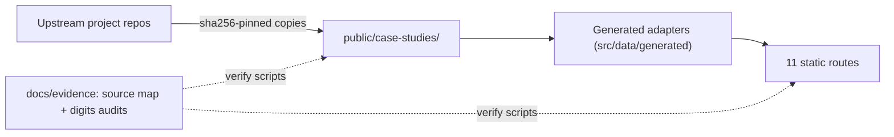

# portfolio-site

**Every number on the site must survive an audit.**

> 这是 [xiangguozhang.com](https://xiangguozhang.com) 的源码仓库：十个项目的展馆。页面上出现的每一个数字，都要能追到生成它的文件、字段和哈希。

This repository builds the exhibition layer of [xiangguozhang.com](https://xiangguozhang.com):
ten measured AI and engineering projects across eleven public routes, each rebuilt as its own
room with its own voice. The projects themselves live in their upstream repositories; what this
codebase adds is the discipline that keeps their numbers honest on the way to a web page —
number → source file → JSON path → SHA-256, enforced by scripts rather than by promises.

> 十个项目分布在十一条公开路由上，每个页面是一间独立的展厅。项目本体在各自的上游仓库；这个仓库负责的是数字上墙前的对账：数字 → 来源文件 → JSON path → SHA-256，靠脚本执行，不靠口头承诺。

## The verification chain · 数字对账

No component carries a literal benchmark number typed into a `.tsx` file. Every rendered digit
traces to a committed artifact through two registers: the
[Round-2 source map](docs/evidence/r2-source-map.md), which freezes each upstream artifact as
`source path → site target → SHA-256 → generating command`, and the ten per-page digits audits
under [`docs/evidence/`](docs/evidence/) (`digits-*.md`), which list each visible number's file,
JSON path, and hash. The scripts below are the receipts — each one fails the build rather than
let a claim drift.

> 组件源码里不允许手打任何基准数字。每个上墙数字经两层登记追溯：[Round-2 source map](docs/evidence/r2-source-map.md) 冻结每份上游产物的来源路径、站内路径、SHA-256 与生成命令；[`docs/evidence/`](docs/evidence/) 下十份 `digits-*.md` 逐页登记每个数字的文件、JSON path 和哈希。下面这些脚本就是收据——对不上就让构建失败。

| Gate | What it enforces | Receipt |
| --- | --- | --- |
| Source integrity | Re-hashes every registered artifact against the frozen source map. | [`scripts/verify-r2-sources.mjs`](scripts/verify-r2-sources.mjs) |
| Evidence parity | Regenerates analytics previews with `--check` and validates rendered claims against their artifacts. | [`scripts/verify-evidence.mjs`](scripts/verify-evidence.mjs) (`npm run verify:evidence`) |
| Performance budgets | Cold-loads every public route in a fresh Chromium context; three route classes hold gzip budgets of **170 / 200 / 240 KB** initial and **50 / 70 / 80 KB** route-own JavaScript, pinned as ratchets that may only tighten. | [`scripts/verify-performance-budget.mjs`](scripts/verify-performance-budget.mjs) |
| Locale purity | Banned-vocabulary lint in both languages, no mixed-script sentences outside an approved-term allowlist, and numeric parity between the English and Chinese renderings of the same claim. | [`scripts/lint-copy.mjs`](scripts/lint-copy.mjs) + [`scripts/check-localization.mjs`](scripts/check-localization.mjs) |
| zh glyph coverage | The self-hosted Chinese serif subset must contain every codepoint the site actually renders — no silent system-font fallback, no tofu. | [`scripts/verify-zh-glyphs.mjs`](scripts/verify-zh-glyphs.mjs) |
| Heavy-asset ledger | Every large download is registered in [`heavy-assets.json`](heavy-assets.json) with exact bytes; the check asserts ledger == file on disk == the byte count the UI advertises before you click. | [`scripts/verify-heavy-assets.mjs`](scripts/verify-heavy-assets.mjs) |
| Recorded vs. live | Replayed material is labeled on-page with literal stamps — `RECORDED ARTIFACT`, `RECORDED / DETERMINISTIC STUB`, `demo · deterministic` — and browser tests assert the labels exist. | Playwright suite (`npx playwright test`) |
| Assistant sources | The ask-portfolio knowledge snapshot is rebuilt from commit-pinned public sources and the per-route question bank (three bilingual questions per route) is schema-checked against it. | [`scripts/build-assistant-knowledge.mjs`](scripts/build-assistant-knowledge.mjs) + [`scripts/generate-ask-question-bank.mjs`](scripts/generate-ask-question-bank.mjs) |


```mermaid
flowchart LR
  U["Upstream project repos"] -->|"sha256-pinned copies"| A["public/case-studies/"]
  A --> G["Generated adapters (src/data/generated)"]
  G --> R["11 static routes"]
  M["docs/evidence: source map + digits audits"] -.->|verify scripts| A
  M -.->|verify scripts| R
```

## Page index · 页面索引

| Route | One line |
| --- | --- |
| `/` | The gallery floor: four stat tiles, a flagship claim chain, and a negative-run table — every digit wired to the receipts register. |
| `/ai/frontier-forge` | The flagship ledger: free rule labels scaled 1,450 → 20,000 lift a 4B model from **66.35% to 99.05%** task success (n=2,000, paired 95% CI); total measured spend **$35.68**; the runs that lost stay on the wall. |
| `/ai/release-guardian` | A control room replaying a 13-node agent gate: 132 funded live runs, 8/8 aggregate gates, the 30/44 strict residual stated beside them. |
| `/ai/rag-quality-lab` | Lab notes on a harmless-looking knowledge-base update that degraded 4 of 12 controlled questions — and the regression suite that caught it, now run against an 11,309-document corpus. |
| `/ai/triage-router` | The case against the expensive default: Claude Sonnet 5 ties Haiku 4.5 at 2.8× the cost, so a confidence cascade routes each complaint to the cheapest capable tier; the int8 deployment model runs in your tab. |
| `/ai/privacy-preflight` | A black box drawn over text is not redaction: detect locally, destroy, then re-open the output to prove the content is gone — nothing leaves the browser. |
| `/ai/ask-portfolio` | The assistant in the corner, exhibited as a project itself: build-time knowledge snapshot, keyword retrieval, a guard model in front, rate limits behind. |
| `/analytics/margin-control-tower` | A working desk, not a dashboard: weekly margin moves decomposed in the browser over a hash-verified Olist aggregate. |
| `/analytics/credit-policy-desk` | A score is not a policy — this desk walks the rest of the way: expected loss, thresholds, review capacity, a recorded human decision. |
| `/engineering/exactly-once-drills` | Ten induced failures against one Flink → Iceberg boundary; all ten recoveries reconciled to zero diff, replayed from committed run records. |
| `/engineering/crossover-study` | A field study over 43.9M Amazon reviews: personalization never beats popularity there — the measured mechanism is 41% catalog churn, and a low-churn corpus shows the crossover at n\*=20. |

<sub>Eleven public routes: the home floor plus ten project rooms · 十一条公开路由：首页加十间展厅</sub>

## Stack · 技术栈

Next.js 16 App Router with static generation, React 19, TypeScript, and Tailwind CSS 4;
Playwright drives the browser gates. Fonts are self-hosted — IBM Plex Latin subsets plus a
Chinese serif subset generated by [`scripts/subset-zh-serif.mjs`](scripts/subset-zh-serif.mjs).
The heavy in-browser engines — DuckDB-WASM for SQL over parquet, onnxruntime-web for in-tab
inference, Tesseract.js for OCR — never load with the page: each sits behind an explicit click
that advertises its ledger-checked size first (the DuckDB engine is 39,362,651 bytes, shared by
the three data routes; the triage int8 model is 67,575,183 bytes).

> 前端是 Next.js 16 App Router 静态生成 + React 19 + TypeScript + Tailwind CSS 4，浏览器门禁由 Playwright 驱动。字体全部自托管，中文衬线子集由 [`scripts/subset-zh-serif.mjs`](scripts/subset-zh-serif.mjs) 生成。DuckDB-WASM、onnxruntime-web、Tesseract.js 这类重引擎一律不随页面加载：先明示体积（该体积与账本核对过），点击后才下载。

## Run and verify · 本地运行与验证

```bash
npm ci
npm run dev
```

The `predev` step vendors the DuckDB-WASM and ONNX runtime browser files out of the installed
npm packages and regenerates the deterministic analytics fixtures; a fresh clone needs no
external service to browse the site.

> `predev` 会从已安装的 npm 包里复制 DuckDB-WASM 与 ONNX runtime 的浏览器文件，并重建确定性的分析 fixtures；新克隆的仓库不依赖任何外部服务即可本地浏览。

The full gate chain, in dependency order:

```bash
npm run typecheck
npm run lint
npm run check:localization    # copy lint + locale purity + numeric parity + zh glyph coverage
npm run verify:r2-sources
npm run verify:evidence
npm run build
npm run verify:heavy-assets   # needs the build manifest and the vendored weights
npm run verify:performance    # cold-loads the built site in Chromium
npx playwright test           # browser suite (run npx playwright install chromium once)
```

Two gates need state a fresh public clone does not carry: `verify:heavy-assets` and the triage
page's in-tab inference expect the gitignored Tier-B2 model weights under `public/models/`,
which are copied from the upstream lab checkout and hash-pinned in
[`heavy-assets.json`](heavy-assets.json) and the source map.

> 有两处依赖新克隆没有的本地状态：`verify:heavy-assets` 与 triage 页面的浏览器端推理需要 `public/models/` 下不入库的 Tier-B2 模型权重；这些权重从上游实验仓库复制，哈希登记在 [`heavy-assets.json`](heavy-assets.json) 与 source map 里。

## Honest boundaries · 边界

The live layer — server-side model inference, agent tooling, a hosted query engine — belongs to
a later phase. What ships today is recorded or deterministic and says so where you stand: agent
runs replay committed records, stubs are labeled deterministic, and in-browser compute
(DuckDB-WASM, the int8 model, OCR) is real but runs on your machine, over pinned data. Numbers
quoted from upstream projects carry their upstream qualifications — a replayed 99.05% is still a
frozen-eval number against a rule policy, not a production claim, and this repository does not
promote any of them beyond what their source artifacts state.

> 在线层——服务端推理、Agent 工具链、托管查询引擎——属于后续阶段。当前上线的内容要么是录制回放，要么是确定性演示，页面原地标明；浏览器内计算（DuckDB-WASM、int8 模型、OCR）是真实执行，但只在访问者本机、基于固定数据运行。引用自上游项目的数字保留上游限定条件，本仓库不做任何超出源产物表述的拔高。

## Rights

No open-source license is granted for this repository or its portfolio content. See
[`NOTICE.md`](NOTICE.md) and the approved public scope in [`PUBLICATION.md`](PUBLICATION.md);
linked external repositories retain their own terms.

> 本仓库及其作品集内容不授予开源许可，公开范围见 [`NOTICE.md`](NOTICE.md) 与 [`PUBLICATION.md`](PUBLICATION.md)；外链仓库各自保留其条款。
