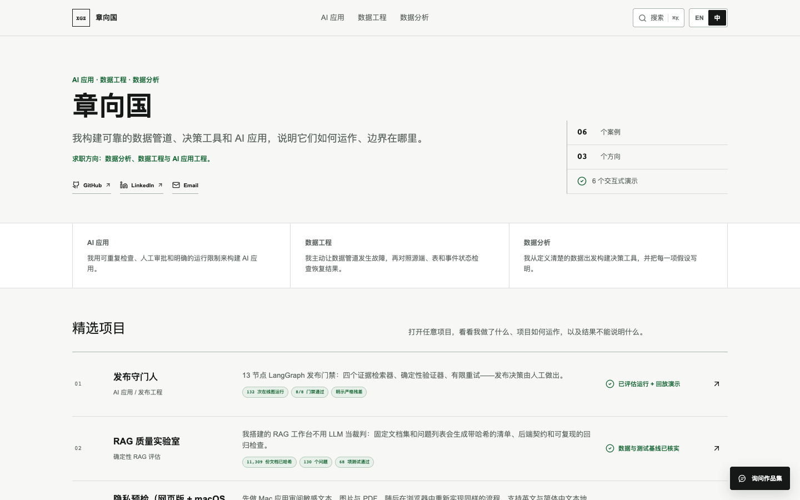
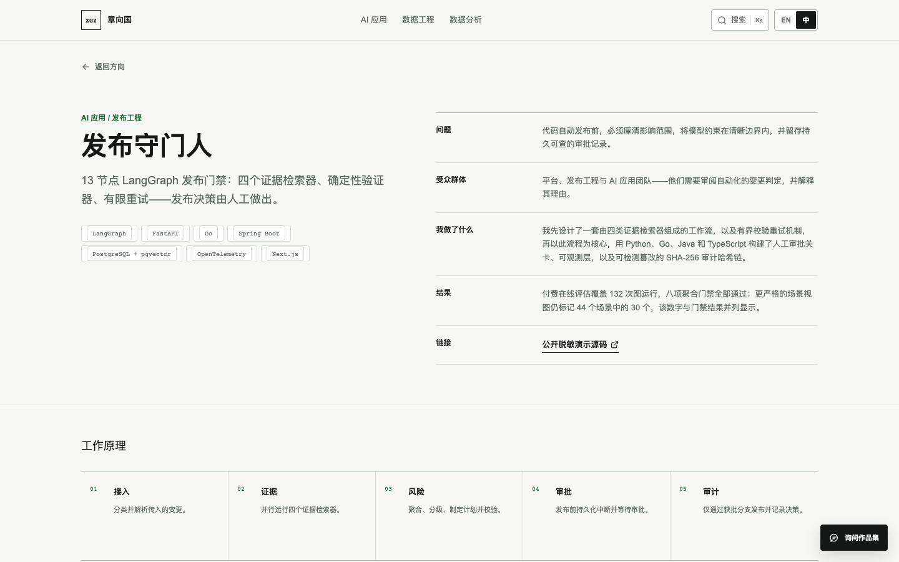
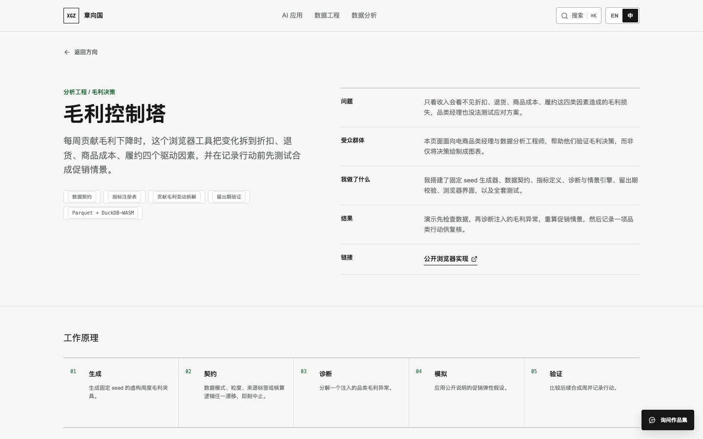

# Xiangguo Zhang — 可操作作品集

这是一个面向证据评审的双语作品集，覆盖 AI 应用、数据工程与决策分析。每个当前案例都
提供可操作流程、可追溯产物，以及对“这些证据不能证明什么”的明确说明。

[English README](README.md) · [证据索引](docs/EVIDENCE_INDEX.md) ·
[公开发布检查单](docs/PUBLICATION_CHECKLIST.md)



## 评审入口

| 序号 | 方向 | 案例 | 可直接检查的内容 | 证据边界 |
| --- | --- | --- | --- | --- |
| 01 | AI 应用 | Release Guardian | 回放合成变更、检查证据并记录人工决定 | 付费在线、确定性 stub 与合成回放三类证据分开 |
| 02 | AI 应用 | RAG Quality Lab | 注入 manifest / 后端契约漂移并运行确定性校验器 | C2 是评估下限；C3 限时运行没有产生指标 |
| 03 | AI 应用 | Privacy Preflight | 在浏览器本机扫描虚构文本、图片和 PDF，并验证破坏式导出 | 只使用虚构夹具；打包范围与 Web 行为分开说明 |
| 04 | 数据分析 | Margin Control Tower | 对比受治理夹具与 Olist 衍生聚合，再检查检测、弹性和有边界情景 | Olist 指标来自离线聚合与确定性扰动重放，不声明因果或真实业务结果 |
| 05 | 数据工程 | Streaming Reliability Lab | 回放五类已记录故障并检查恢复与对账证据 | 五月历史捕获与七月本地 Mac 复现分开 |
| 06 | 数据分析 | Credit Policy Lab | 对比受治理夹具与仅含已授信贷款的回测，再调整阈值并检查队列容量 | 仅含已授信贷款的回测不构成公平性、合规或生产结论 |

`/analytics/analytics-tandem` 仅保留为两个重建分析案例的兼容入口，不是第七个项目。

## 架构与证据流

- **展示层：** Next.js App Router、React、TypeScript；`/`、`/[track]` 与
  `/[track]/[project]` 固定页面保持静态生成。`/artifact` 会读取请求特定的
  `searchParams`，虽保持 Vercel 兼容，但不归类为固定静态路由。
- **证据层：** JSON、CSV、Parquet、Markdown、Mermaid、图片与 PDF 衍生物位于
  `public/case-studies/`，支持的格式可在站内直接检查。
- **复现层：** `pipelines/` 记录分析产物的生成命令、输入哈希、运行环境、来源与输出校验。
- **声明控制：** `src/lib/projects.ts`、`docs/EVIDENCE_INDEX.md` 与证据校验器共同约束可见数字、
  来源和 limitation 文案。

从 [`docs/EVIDENCE_INDEX.md`](docs/EVIDENCE_INDEX.md) 开始，可以把页面声明逐项追到精确
产物、实现/流水线、复现路径和边界。

## 当前评审截图

| Release 证据层级 | Margin 真实数据决策流程 |
| --- | --- |
|  |  |

这些 1440×900 Google Chrome 图片用于核对当前身份与页面顶部，不能替代源码或机器证据。
历史完整截图集仍作为带日期的改造前状态保留。对已经运行的 production 候选执行
`npm run capture:public-review`，可重新生成当前六个案例以及桌面/移动首页截图。

## 本地运行与交付门禁

```sh
npm ci
npm run dev
```

```sh
npm run typecheck
npm run lint
npm run verify:evidence
npm run verify:assistant
npm run verify:assistant-public-sources
npm run build
npm run verify:performance
npm run test:e2e -- --workers=1
npm audit --omit=dev
```

当前评审 Mac 上串行执行浏览器测试，以避免主机级 Chrome 资源争用。双语助手会从固定 Git
commit 的公开仓库快照和经审阅的私有候选人材料中检索证据，再通过仅允许零数据保留端点的
OpenRouter 路由调用中英文不同的解说模型。
[`docs/assistant-operations.md`](docs/assistant-operations.md) 记录其本地/Vercel 环境变量、
Upstash Redis 限流、证据优先级、失败即拦截行为与密钥边界。提交内的公开边界见
[`STATE.md`](STATE.md)；远端分支、PR 与部署的 owner-gated 步骤见
[`docs/PUBLICATION_CHECKLIST.md`](docs/PUBLICATION_CHECKLIST.md)。

## 证据纪律

- Release Guardian 将 8/8 聚合门禁与付费在线 30/44 strict 残差同时呈现；strict 口径是
  任一条件在三次 trial 的任一次失败，就标记该场景。
- Streaming Reliability Lab 不跨历史环境与本地 Mac 环境迁移解释结果。
- RAG Quality Lab 不为没有产出指标的 C3 限时运行添加替代结果。
- Privacy Preflight 只使用虚构夹具；源码构建、浏览器流程、打包、签名与公证分别声明。
- 分析案例区分固定 seed 合成夹具与流水线衍生数据，保留许可/来源信息，不声明真实运营影响。

## 权利说明

本仓库及作品集内容不授予开源许可，详见 [`NOTICE.md`](NOTICE.md)。已批准的公开范围与
不可变证据限制记录在 [`PUBLICATION.md`](PUBLICATION.md)；外部仓库沿用各自条款。
